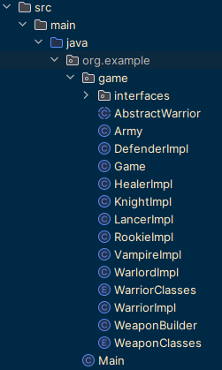
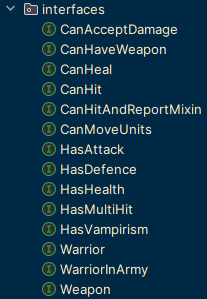
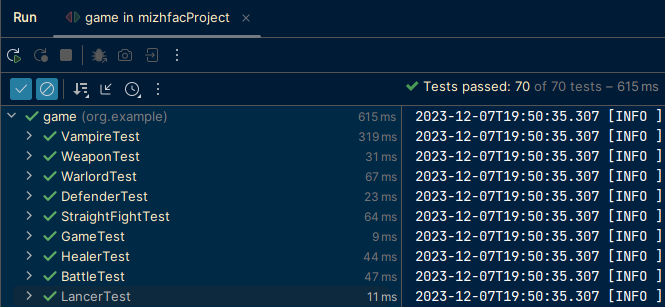

Проект виконаний для міжфакультетної дисципліни "Об’єктно орієнтований дизайн та шаблони проєктування на Java" ХНУ ім. Каразіна.

Були реалізовані всі завдання, що ставились впродовж курсу в повному обсязі.

  

Всі 70 тестів проходять перевірку! 

Власну ідею не реалізував, але багато чому навчився, та залишився дуже задоволений!

Обрав на настуний семестр Вашу міжфакультетну дисципліну з Веб-програмування на Java)

Дуже дякую!!!